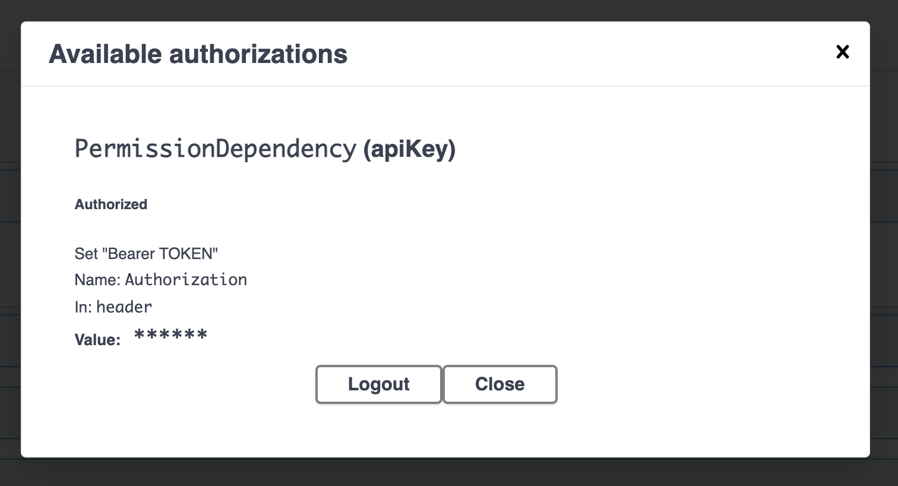

# FastAPI API

## Requirements

- poetry
- python 3.8
- pytest
- docker
- docker-compose

## Run Development with docker

```bash
docker-compose up -d
```

## Run Development with python

In order to run development with python, db and redis should should be running, the easy path to do that is running 'docker-compose up db -d' and 'docker-compose up redis -d'

```python
python3 main.py --env local|dev|prod --debug
```

## Run Tests

In order to run test with pytest, db and redis should should be running. The easy path to do that is running 'docker-compose up db -d' and 'docker-compose up redis -d'

```python
poetry install
poetry shell
ENV=test pytest tests/
```

## Documentation

Some swagger documentation is located at:

[http://localhost:8000/docs#/](http://localhost:8000/docs#/)

You could use the swagger authentication in order to call other endpoints to do that just:

- Sign up with valid data
- Sign in with the created user
- Authenticate on the swagger web with "Bearer TOKEN"
  
